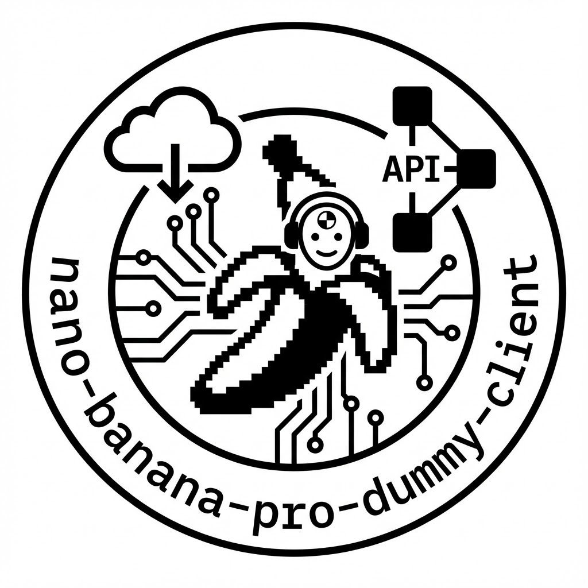
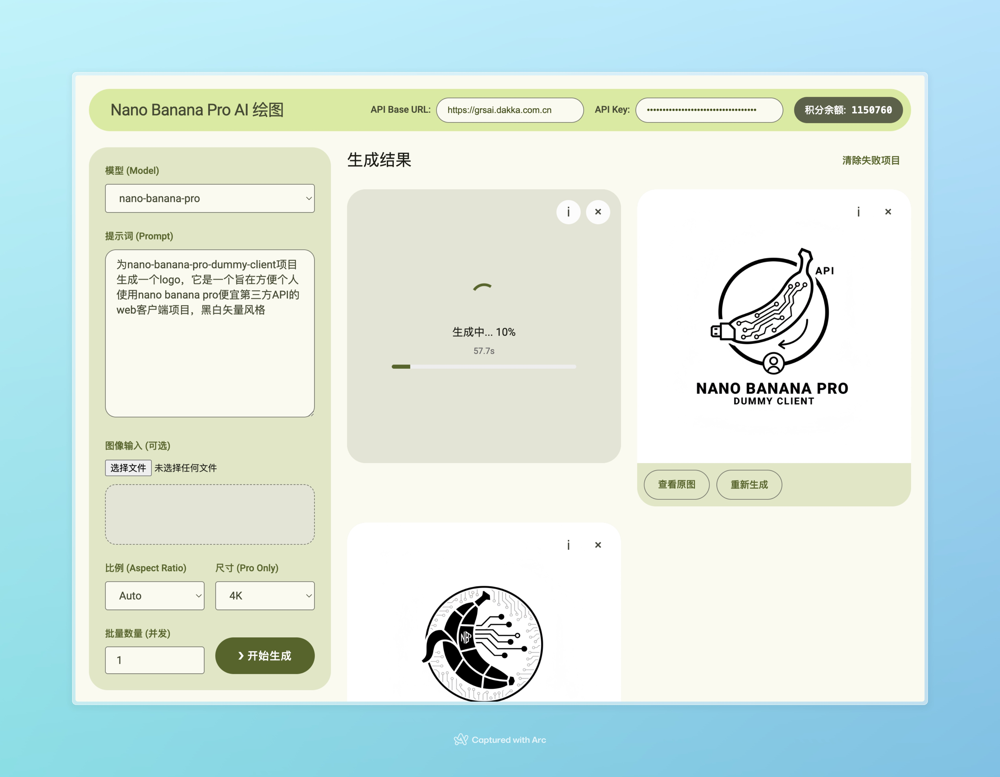

# nano-banana-pro-dummy-client

在线使用：https://wusiyu.github.io/nano-banana-pro-dummy-client/

一个旨在方便个人使用Nano Banana Pro的便宜第三方API的客户端WebUI，提供非阻塞的连续生成、多图并发生成、失败重试等功能，更方便使用这些可能不稳定或高延迟的第三方API。

目前支持的第三方API提供商：
- Grsai API (https://grsai.com/zh/dashboard/documents/nano-banana)
- ...欢迎PR

> 注：本项目与上述所有API提供方无任何关联，仅为个人使用方便而开发，你想用于商业用途我也没办法，发生什么问题请去找他们
>
> 本项目为纯前端静态HTML+JS实现，不包含任何后端服务，所有请求均直接从浏览器发出到API提供商，本项目不会知悉任何用户请求数据，也不对其负责 
> API Key会保存在浏览器本地存储中，在公用电脑上使用请注意清除

## 功能
- 支持文生图、文+图生图（可选上传参考图）
- 支持连续生成（保留当前会话的结果卡片）
- 支持并发请求生成（同时发多个请求，得到多个结果）
- 支持失败重试（单个结果卡片失败后可单独重试）
- 支持查看结果卡片的请求信息，可以一键复制prompt或批量重发

## 使用方法
直接访问：https://wusiyu.github.io/nano-banana-pro-dummy-client/

*或者：*
1. 克隆本仓库或下载zip到本地
2. 打开`index.html`，在API配置区域填写你的API Base URL和API Key
3. 输入你的生成参数，点击生成按钮开始使用
4. 生成的结果会显示在下方结果区域，你可以查看每个结果的详细信息，复制prompt，或重试失败的请求
